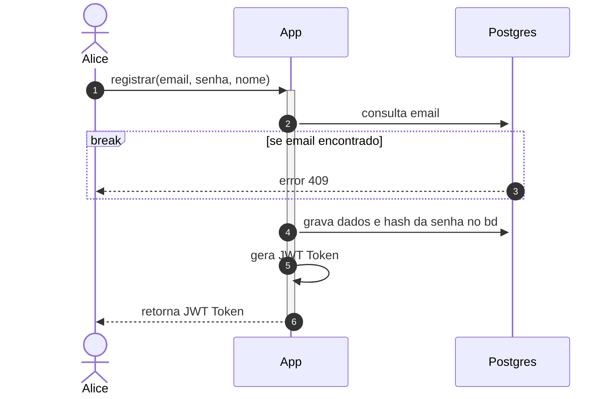
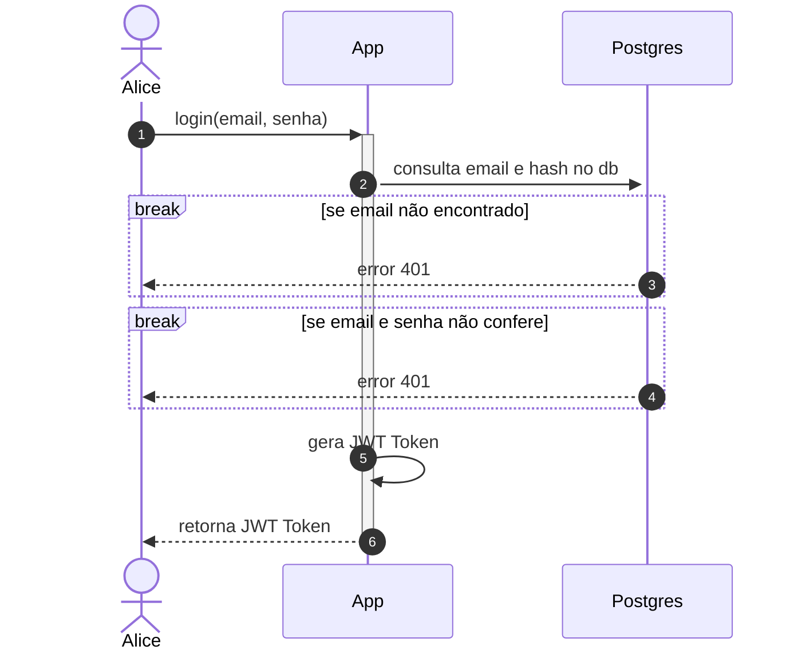
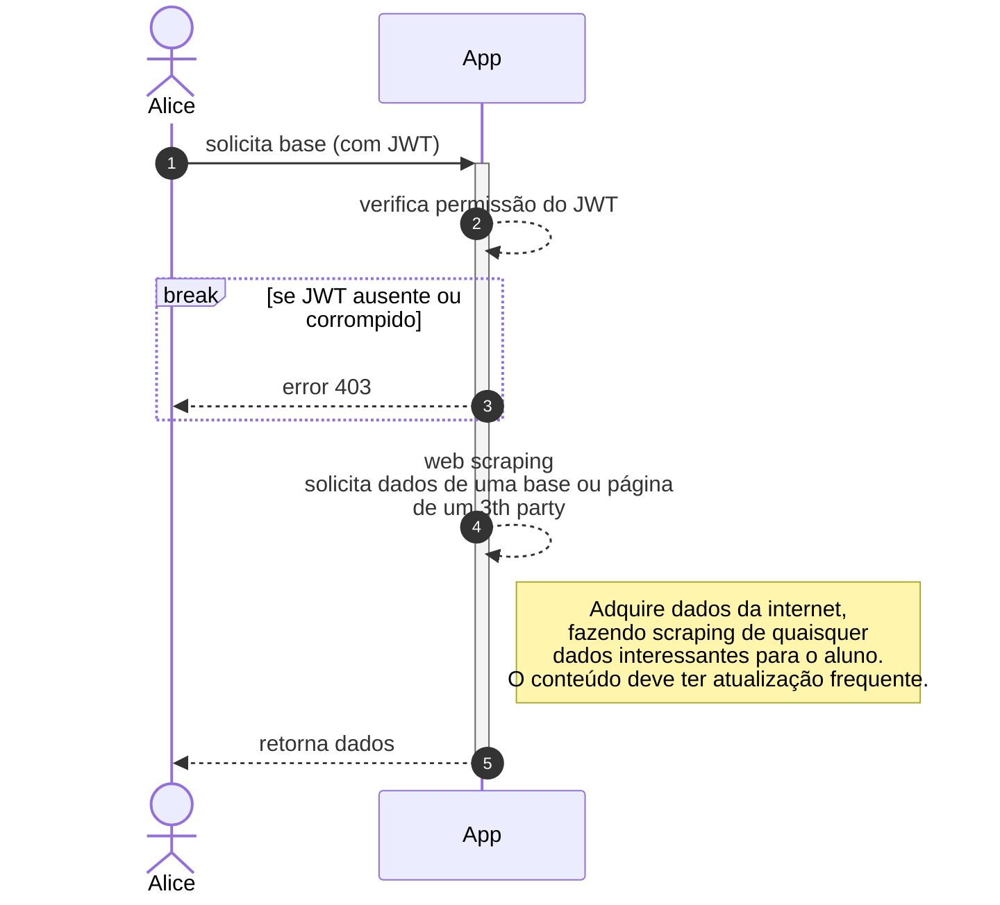
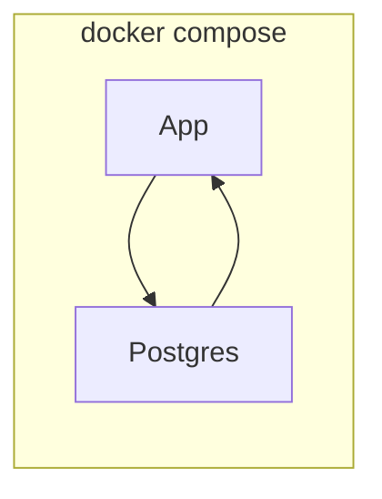

# Insper > Cloud >> Projeto

O projeto é dividido em 2 partes:

1. **Aplication Backend**: API RESTful em Node.js com Express e Postgres.
2. **Frontend**: Aplicação em React.js.

``` bash
source ./venv/bin/activate
```

## Aplicativo

### Instalação
```bash
{
    "nome": "Disciplina Cloud",
    "email": "cloud@insper.edu.br",
    "senha": "cloud0"
}
```

### CADASTRO


### LOGIN


## DADOS


## Docker Compose
