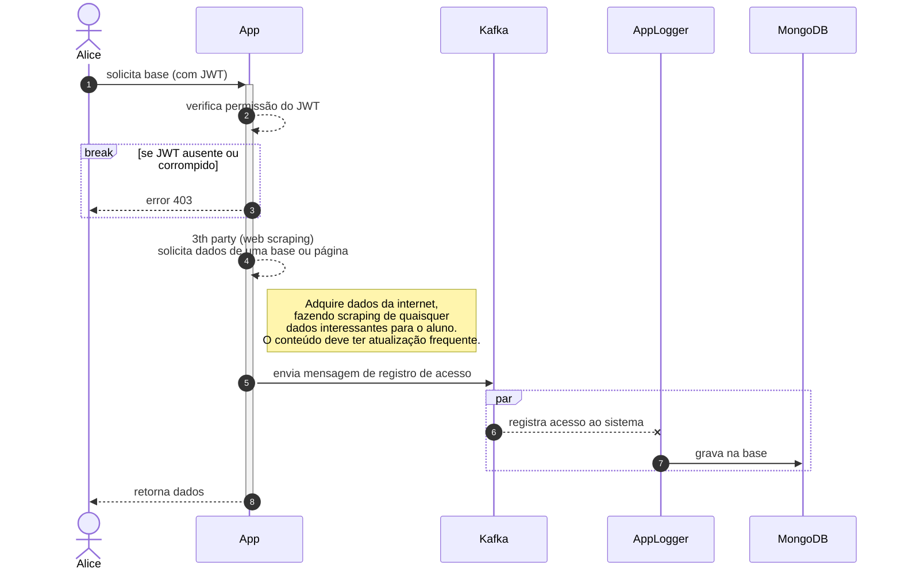
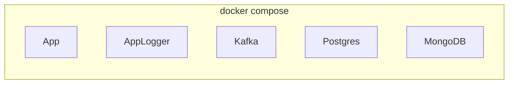

# insper.cloud.projeto

## CADASTRO
```mermaid
sequenceDiagram
    autonumber
    actor Alice
    Alice->>+App: registrar(email, senha, nome)
    App->>+Postgres: consulta email
    break se email encontrado
        Postgres-->>Alice: error 409
    end
    App->>Postgres: grava dados e hash da senha no bd
    App->>App: gera JWT Token
    App-->>-Alice: retorna JWT Token
````

## LOGIN
```mermaid
sequenceDiagram
    autonumber
    actor Alice
    Alice->>+App: login(email, senha)
    App->>+Postgres: consulta email e hash no db
    break se email não encontrado
        Postgres-->>Alice: error 401
    end
    break se email e senha não confere
        Postgres-->>Alice: error 401
    end
    App->>App: gera JWT Token
    App-->>-Alice: retorna JWT Token

```

## DADOS


## Docker Compose
